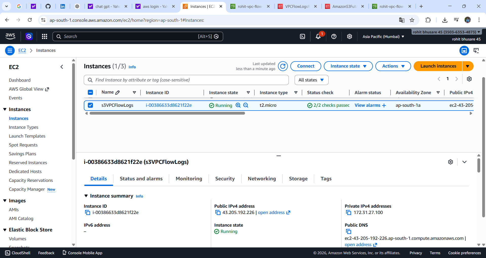
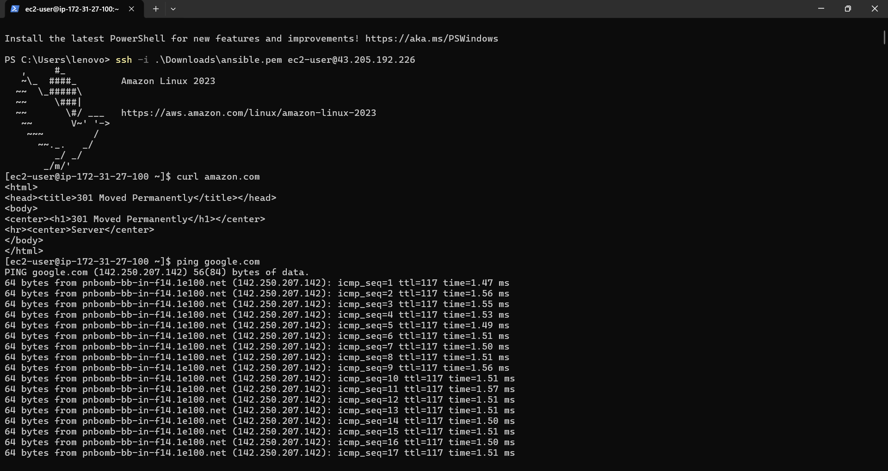
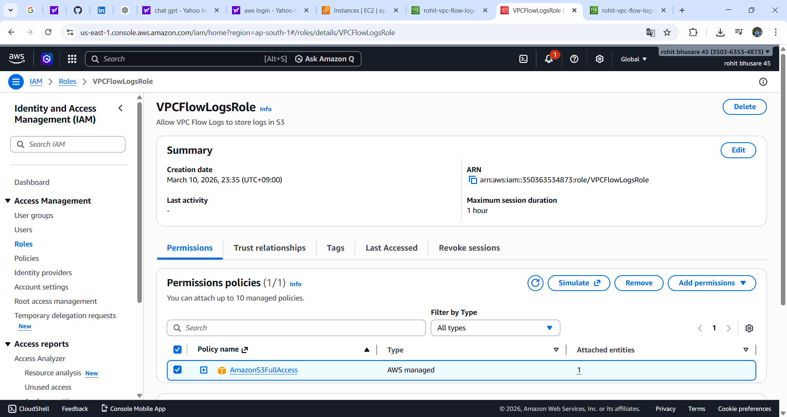
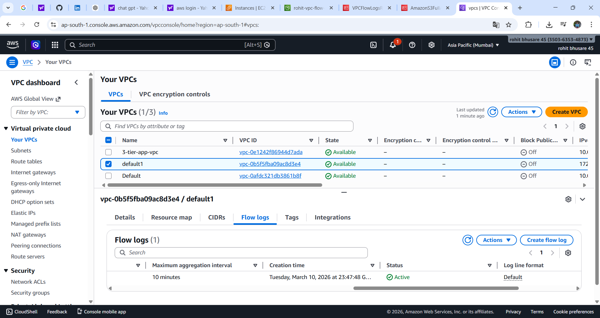
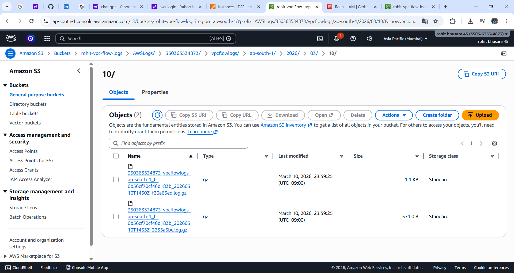

# 🚀 AWS DevOps Project 2

# Configure VPC Flow Logs and Store Logs in Amazon S3 Using IAM Role

---

# 📌 Project Overview

This project demonstrates how to enable **VPC Flow Logs** in AWS and store the captured **network traffic logs** in an **Amazon S3 bucket** using an **IAM Role**.

VPC Flow Logs allow users to monitor and analyze network traffic flowing through their **Virtual Private Cloud (VPC)**. These logs help in **security monitoring, troubleshooting network connectivity, and auditing traffic behavior**.

In this project, we configure VPC Flow Logs to capture traffic data and store it securely in an S3 bucket.

---

# 🏗 Project Architecture

```
EC2 Instance
      │
      │ Generate Network Traffic
      ▼
VPC Flow Logs
      │
      │ IAM Role Permission
      ▼
Amazon S3 Bucket
      │
      ▼
Flow Log Files (.log.gz)
```

---

# 🛠 AWS Services Used

| Service       | Purpose                    |
| ------------- | -------------------------- |
| Amazon EC2    | Generate network traffic   |
| Amazon VPC    | Create network environment |
| VPC Flow Logs | Capture network traffic    |
| Amazon S3     | Store log files            |
| AWS IAM       | Manage permissions         |

---

# ⚙ Implementation Steps

---

# 1️⃣ Launch EC2 Instance

An **Amazon EC2 instance** was launched inside the VPC to generate network traffic.

Steps:

1. Go to AWS Console
2. Open **EC2 Service**
3. Click **Launch Instance**
4. Choose **Amazon Linux AMI**
5. Select instance type **t2.micro**
6. Create or select a key pair
7. Launch the instance

### Screenshot



---

# 2️⃣ Connect to EC2 and Generate Traffic

The EC2 instance was accessed using SSH to generate network traffic.

Commands used:

```
curl amazon.com
ping google.com
```

These commands generate **outbound network traffic**, which is captured by **VPC Flow Logs**.

### Screenshot



---

# 3️⃣ Create S3 Bucket

An **Amazon S3 bucket** was created to store the VPC Flow Logs.

Steps:

1. Open **Amazon S3**
2. Click **Create Bucket**
3. Enter bucket name:

```
rohit-vpc-flow-logs
```

4. Select region
5. Keep other settings default
6. Click **Create bucket**

The bucket will store log files generated by VPC Flow Logs.

---

# 4️⃣ Create IAM Role for Flow Logs

An IAM Role was created to allow the **VPC Flow Logs service** to write logs into the S3 bucket.

Steps:

1. Go to **IAM**
2. Click **Roles**
3. Click **Create Role**
4. Select **Custom Trust Policy**

Trust policy:

```json
{
 "Version": "2012-10-17",
 "Statement": [
  {
   "Effect": "Allow",
   "Principal": {
    "Service": "vpc-flow-logs.amazonaws.com"
   },
   "Action": "sts:AssumeRole"
  }
 ]
}
```

Attach permission:

```
AmazonS3FullAccess
```

Role Name:

```
VPCFlowLogsRole
```

### Screenshot



---

# 5️⃣ Enable VPC Flow Logs

Flow Logs were enabled for the VPC to capture network traffic.

Steps:

1. Go to **VPC Console**
2. Click **Your VPCs**
3. Select the VPC
4. Open **Flow Logs Tab**
5. Click **Create Flow Log**

Configuration used:

```
Filter: ALL
Destination: Send to an Amazon S3 bucket
S3 Bucket ARN: arn:aws:s3:::rohit-vpc-flow-logs
IAM Role: VPCFlowLogsRole
Log Format: AWS Default Format
```

### Screenshot



---

# 6️⃣ Verify Logs in Amazon S3

After generating traffic, VPC Flow Logs automatically create log files inside the S3 bucket.

Path:

```
S3
 → rohit-vpc-flow-logs
 → AWSLogs
 → Account-ID
 → vpcflowlogs
 → region
 → year
 → month
 → day
```

Log files appear in compressed format:

```
.log.gz
```

### Screenshot



---

# 📄 Sample Flow Log Entry

Example log record:

```
2 123456789 eni-123abc 10.0.1.5 172.217.10.14 443 52344 6 10 840 1678900000 1678900060 ACCEPT OK
```

Explanation:

| Field    | Description            |
| -------- | ---------------------- |
| eni      | Network Interface ID   |
| srcaddr  | Source IP Address      |
| dstaddr  | Destination IP Address |
| srcport  | Source Port            |
| dstport  | Destination Port       |
| protocol | Network Protocol       |
| packets  | Number of packets      |
| bytes    | Number of bytes        |
| action   | ACCEPT or REJECT       |

---

# 📊 Key Benefits of VPC Flow Logs

* Monitor VPC network traffic
* Detect suspicious activity
* Troubleshoot network issues
* Analyze security group rules
* Perform network auditing

---

# 🎯 Key Learnings

Through this project we learned:

* How to configure **VPC Flow Logs**
* How to store logs in **Amazon S3**
* How to use **IAM Roles for secure access**
* How to analyze network traffic logs
* How AWS networking works in real environments

---

# 👨‍💻 Author

**Rohit Bhusare**

Aspiring **DevOps Engineer | Cloud Enthusiast**

---

⭐ If you like this project, please consider giving it a **star on GitHub**.
